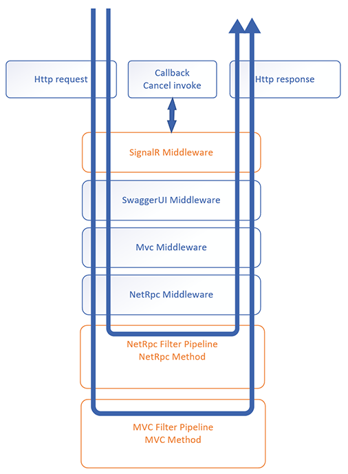
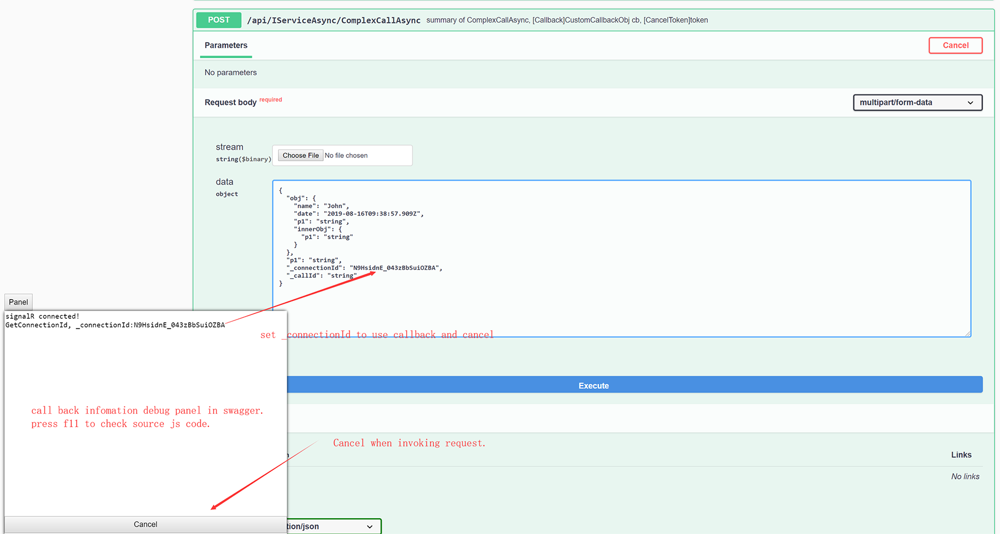

# NetRpc.Http
NetRpc.Http provide:
* **Webapi** for call.
* **Swagger** for view api and test.
* **SignalR** for callback and cancel during method invoking.



## Create Host
* Use **NetRpcManager** create host:
```c#
//service
var webHost = NetRpcManager.CreateHost(
    8080,
    "/callback",
    true,
    new HttpServiceOptions { ApiRootPath = "/api"}, 
    null,
    typeof(ServiceAsync));
await webHost.RunAsync();
```
* Use DI to create NetRpcHttp service, also could create NetRpcHttp service base on exist MVC servcie.
```c#
//regist services
services.AddSignalR();         // add SignalR service if need cancel/callback support
services.AddNetRpcSwagger();   // add Swgger service
services.AddNetRpcHttp(i =>    // add RpcHttp service
{
    i.ApiRootPath = "/api";
    i.IgnoreWhenNotMatched = false;
    i.IsClearStackTrace = false;
}, i =>
{
    i.UseMiddleware<MyNetRpcMiddleware>();   // define NetRpc Middleware
});
services.AddNetRpcServiceContract(instanceTypes); // add Contracts
```
```c#
//use components
app.UseSignalR(routes => { routes.MapHub<CallbackHub>(hubPath); });   // define CallbackHub if need cancel/callback support
app.UseNetRpcSwagger();   // use NetRpcSwagger middleware
app.UseNetRpcHttp();      // use NetRpcHttp middleware
```
## Samples
* [Http](../../samples/Http)
## Supported interface type
[Compatible all types here](../../#supported)
## Swagger
Use [Swashbuckle.AspNetCore.Swagger](https://github.com/domaindrivendev/Swashbuckle.AspNetCore) to implement swagger feature.

Add codes below to enabled swagger function.
```c#
services.AddNetRpcSwagger();   // add Swgger service
...
app.UseNetRpcSwagger();        // use NetRpcSwagger middleware
```
The demo show how to call a method with callback and cancel:


If define Callback Action\<T> and CancelToken supported, need set **\_connectionId** and **_callId** when request.
OperationCanceledException will receive respones with statuscode 600.  



Also support summary on model or method.
## Callback and Cancel
Contract define the **Action\<T>** and **CancellationToken** to enable this feature.
```c#
Task CallAsync(Action<int> cb, CancellationToken token);
```
Client code belows show how to get connectionId, how to receive callback, how to cancel a method.
```javascript
//client js side
var connection = new signalR.HubConnectionBuilder().withUrl("{hubUrl}").build();

//GetConnectionId function
connection.start().then(function () {
    addText("signalR connected!");
    connection.invoke("GetConnectionId").then((cid) => {
        addText("GetConnectionId, _connectionId:" + cid);
    });
}).catch(function (err) {
    return console.error(err.toString());
});

//Callback
connection.on("Callback", function (callId, data) {
    addText("callback, callId:" + callId + ", data:" + data);
});

//Cancel
document.getElementById("cancelBtn").addEventListener("click", function (event) {
    connection.invoke("Cancel").catch(function (err) {
        return console.error(err.toString());
    });

    event.preventDefault();
});
```
## NetRpcProducesResponseType

If contract has **Exception** defined, should use **NetRpcProducesResponseType** to define **statuscode**, 
use **response code** to define summary(will display in Swagger), 
otherwise NetRpc will use statuscode **400** to define all Exception by default.

```c#
/// <response code="400">CustomException error.</response>
/// <response code="401">CustomException2 error</response>
[NetRpcProducesResponseType(typeof(CustomException), 400)]
[NetRpcProducesResponseType(typeof(CustomException2), 401)]
Task CallByCustomExceptionAsync();
```

